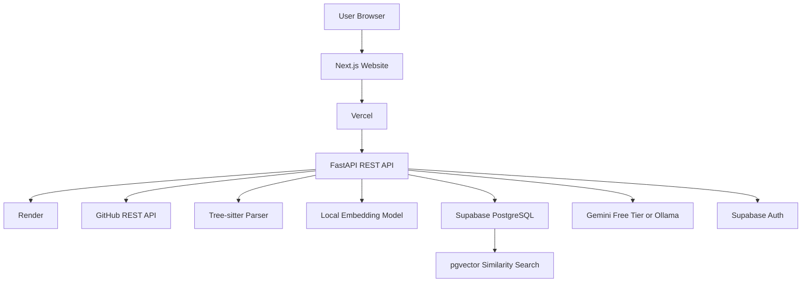
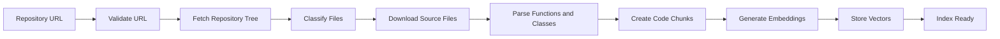
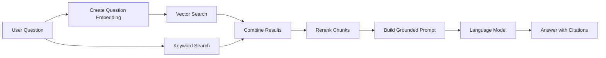
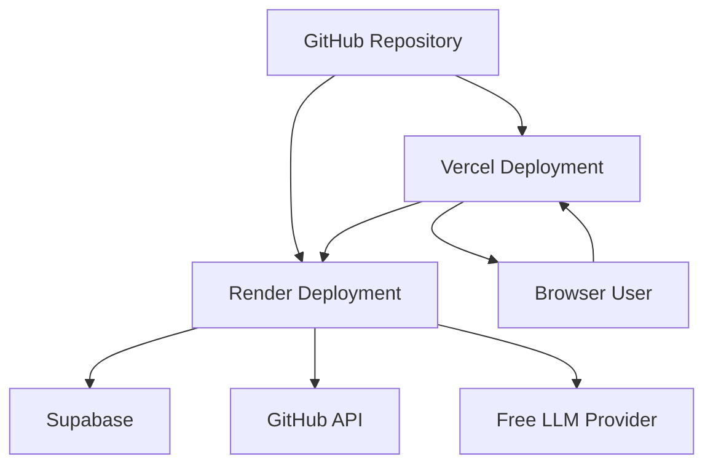

# CodeLens AI System Architecture

## 1. Architecture Overview

CodeLens AI follows a three-tier web architecture:

1. Presentation layer: Next.js website.
2. Application layer: FastAPI backend.
3. Data and AI layer: GitHub API, Supabase, vector search, embeddings, and LLM.

The user interacts with the website through a browser. The website sends API requests to the FastAPI backend. The backend retrieves repository data, processes code, searches vectors, and generates answers.

## 2. Architecture Diagram

## 3. Repository Indexing Flow

## 4. Question Answering Flow

## 5. Deployment Architecture

## 6. Major Components

### Next.js Website

Responsible for:

- Pages.
- Forms.
- Dashboard.
- Chat interface.
- Progress display.
- Error messages.
- Source citation display.

### FastAPI Backend

Responsible for:

- API routes.
- Authentication verification.
- GitHub integration.
- Indexing jobs.
- Code parsing.
- Retrieval.
- Prompt creation.
- LLM communication.

### GitHub API

Responsible for:

- Repository metadata.
- Repository tree.
- File contents.
- Branch information.
- Commit information.

### Tree-sitter

Responsible for:

- Parsing source files.
- Detecting functions.
- Detecting classes.
- Detecting methods.
- Providing line ranges.

### Embedding Model

Responsible for converting code chunks and user questions into numerical vectors.

### Supabase PostgreSQL

Responsible for:

- Users.
- Repositories.
- Files.
- Code chunks.
- Indexing jobs.
- Chat conversations.
- Vector embeddings.

### Language Model

Responsible for generating a natural-language response from retrieved repository context.

## 7. Security Boundaries

- Frontend never receives private API keys.
- GitHub tokens remain in the backend environment.
- Database access is controlled by authentication.
- Repository ownership is verified before querying.
- LLM receives only selected repository context.
- Generated code is never executed automatically.